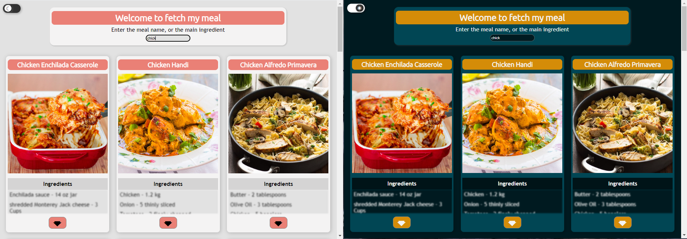

### Fetch-my-meal

Recipes fetcher and displayer

## Technos

## How to use it
+ Simply write an ingredient (or the first letters)
+ Navigate with mouse or keyboard through the recipies
+ Enjoy your meal!

# Additional comment
I hardly consider a remake with an improved color contrast, and accessibility features
Stay tuned!